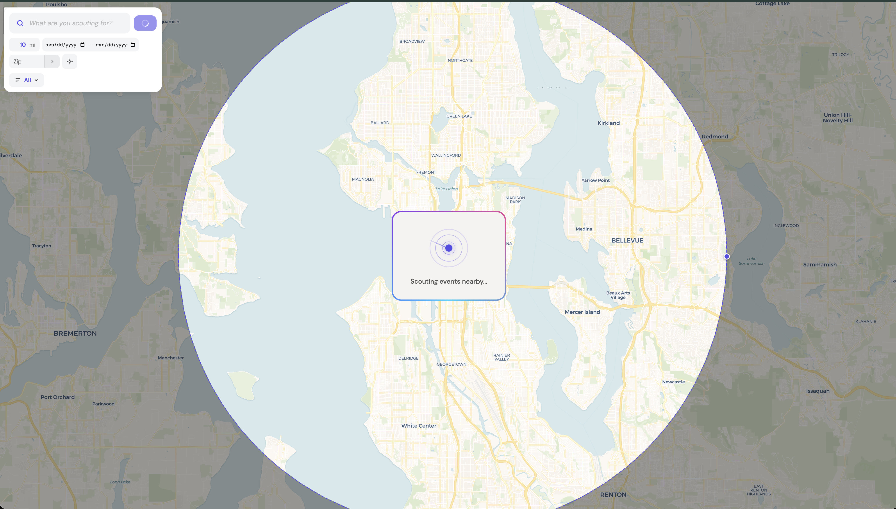

# Scout

Drop a pin anywhere on the map, set a radius, and instantly discover events happening nearby. No API keys required.

 



## What it does

Scout scrapes public event listings from Eventbrite and AllEvents to find concerts, food festivals, comedy shows, yoga classes, and everything in between. Every event appears as a pin on the map so you can see what's happening around you at a glance.

**Key features:**
- Drop a pin or enter a zip code to search any location
- Adjustable radius with draggable circle and gray mask overlay
- Date range filtering (single day or multi-day)
- Category filters (Music, Sports, Food & Drink, Kids & Family, etc.)
- Free-text search across event names, descriptions, and venues
- Marker clustering for dense areas
- Event detail panel with images, dates, venues, and direct links
- Radar-pulse loading animation with rotating gradient border

## Tech stack

| Layer | Tech |
|-------|------|
| **Backend** | Python / Flask |
| **Scraping** | BeautifulSoup + lxml (JSON-LD parsing) |
| **Map** | Leaflet.js + CartoDB Voyager tiles |
| **Clustering** | Leaflet.markercluster |
| **Geocoding** | Zippopotam.us (zip), BigDataCloud + Nominatim (reverse) |
| **Frontend** | Vanilla JS, DM Sans, CSS animations |

## Getting started

```bash
git clone https://github.com/StuckInTheNet/Scout.git
cd Scout
python3 -m venv venv
source venv/bin/activate
pip install -r requirements.txt
python app.py
```

Open [http://localhost:5050](http://localhost:5050) and start scouting.

## How it works

1. **You drop a pin** (or enter a zip code, or allow geolocation)
2. **Scout scrapes** Eventbrite and AllEvents in parallel using thread-local HTTP sessions
3. **Events are deduplicated** by name similarity and filtered by distance (2x radius)
4. **Geocoding** resolves venue addresses to coordinates via cached Nominatim/BigDataCloud lookups
5. **The map renders** clustered markers with source-colored dots, dimmed markers for events outside the radius, and a gray overlay mask

## Project structure

```
Scout/
  app.py                 # Flask server + scrapers
  requirements.txt       # Python dependencies
  templates/
    index.html           # Full frontend (map, UI, JS)
```

## No API keys needed

Scout uses web scraping (JSON-LD structured data) instead of paid APIs. Event platforms embed this data for SEO, making it reliable and free to parse. Geocoding uses free, keyless services (Zippopotam.us, BigDataCloud, Nominatim).

## License

MIT
